# Evolutionary Optimization

Black-box and derivative-free optimization is a discipline in mathematical optimization that does not use derivative information in the classical sense to find optimal solutions <sup>[15]</sup>. The algorithm may query the value of objective function `f(x)` for a point `x`, but it does not obtain gradient information, and in particular it cannot make any assumptions on the analytic form of `f`.  Information about the derivative of `f` is not always available, unreliable or impractical to obtain. For example, `f` might be discrete, non-smooth, time-consuming to evaluate, or in some way noisy. Black-box and derivative-free optimization methods are often the only realistic and practical tools available to engineers working on simulation-based design. <sup>[16]</sup>

We present `evolutionary-optimization`, a collection of black-box optimizers with a focus on evolutionary algorithms (EA).  EA is a subset of evolutionary computation in the domain of artificial intelligence. <sup>[14]</sup>  We can also refer them as generic population-based meta-heuristic optimization algorithms. <sup>[17]</sup>

For the comparison, as well as the completeness, we also include non-population-based derivative-free optimizations from `Scipy`.  Together we present a toolset of 7 drop-and-go black-box optimizers:

Population-based algorithms (EA optimizers):
- GA: Genetic Algorithm
- PSO: Particle Swarm Optimization
- DEA: Differential Evolution Algorithm

Non-population-based algorithms (Scipy's implementation):
- NM: Nelder-Mead Optimization
- BFGS: Derivative-free BFGS
- POW: Powell optimization
- BH: Basin-hopping optimization


## Implementation and Usage

The software is open source and is available on our Github.

    https://github.com/strongio/evolutionary-optimization

Here is an outline of the basic usage of `evolutionary-optimization`.

```python
import OptimizerFactory

# supported optimization subroutines
OPTIONS = ['ga', 'pso', 'dea', 'nm', 'bfgs', 'pow', 'bh']

# optimization of choice
OPTION = 'dea'
assert OPTION in OPTIONS

# define the number of parameters of the objective function
PARAM_COUNT = 5

# define the objective function to be maximized
def objective_function(X):
    return -sum([x**2 for x in X])

# initiate a black-box optimizer
optimizer = OptimizerFactory.create(option=OPTION, param_count=PARAM_COUNT)

# set hyper-parameters, optional
optimizer.optimizer.population_size = 10
optimizer.optimizer.max_iterations = 500

# optimize, print progress to standard out, and return solution
best_params = optimizer.maximize(objective_function)

# evaluate final solution to obtain the optima fitness
best_fitness = objective_function(best_params)
```

In the following sections, we will detail the theoretical background of each optimization algorithm followed by its progression report.

### Genetic algorithm (GA)

A Genetic Algorithm (GA) is a type of evolutionary algorithm. This optimization technique gained popularity through the work of John Holland in the early 1970s <sup>[2]</sup>. It operates by encoding potential solutions as simple chromosome-like data structures and then applying genetic alterations to those structures. Over many iterations, its population of chromosomes evolves toward better solutions, which it determines based on fitness values returned from an objective function. The algorithm typically terminates when the diversity of its population reaches a predetermined minimum, a maximum length of time expires, or a maximum number of iterations has completed.


GAs typically operate in three phases.  See the figure above, where arrows indicate transitions into the next genetic operation within one generation.  In one iteration of the genetic algorithm's evolution, it operates in three stages:

1. Selection, where it chooses a relatively fit subset of individuals for breeding;
2. Crossover, where it recombines pairs of breeders to create a new population; 
3. Mutation, where it potentially modifies portions of new chromosomes to help maintain the overall genetic diversity.

A variety of selection schemes exist. In Roulette Wheel Selection (RWS) <sup>[3]</sup>, the algorithm selects individuals based on their relative fitness within the population.  While RWS works by repeatedly sampling the population, a variation of RWS, Stochastic Universal Sampling (SUS) <sup>[4]</sup>, uses a single random value to sample all breeders by choosing them at evenly spaced intervals; this gives less fit individuals a greater chance to breed. RWS and SUS are both examples of fitness proportionate selection, but other selection schemes are based only on rank, and these are particularly beneficial when the lower and upper bounds of a fitness function are hard to determine. For example, in Tournament Selection <sup>[5]</sup>, the algorithm selects an individual with the highest fitness value from a random subset of the population.

Several Crossover schemes exist. In One Point Crossover, the algorithm chooses a single point on both parents' chromosomes, and it forms the child by concatenating all data prior to that point from the first parent with all data after that point from the second parent. In Two Point Crossover, the algorithm instead chooses two points, which splits the parents' chromosomes into three regions; the algorithm then forms the child by concatenating the first region from the first parent, the second region from the second parent, and the third region from the first parent. In Uniform Crossover, each position on the child's chromosome has equal opportunity to inherit its data from either parent. While nature serves as the inspiration for One and Two Point Crossover, Uniform Crossover <sup>[6]</sup> has no such biological analogue.

Every position on every chromosome has a certain probability to mutate, which helps the population maintain or even improve its genetic diversity. Several variants of this technique exist. In Uniform Mutation <sup>[7]</sup>, when a position mutates, the algorithm replaces its value with a new value, chosen at random, between a predetermined lower and upper bound. In another variant, Gaussian Mutation <sup>[8]</sup>, when a position mutates, its current value increases or decreases based on a Gaussian random value.

Here is an example output of the progression of GA.  All parameters controlling this three-stage "genetic" evolution are tunable.

```
#
# 2018-09-17 11:17:17.665786
#
# algorithm            = _GAOptimizer
# timeout              = None
# elite_count          = 1
# max_iterations       = 3
# population_size      = 5
# initialization       = UniformInitialisation
# selection            = TournamentSelection
# tournament_ratio     = 0.1
# selection_ratio      = 0.75
# mutation             = GaussianMutation
# point_mutation_ratio = 0.15
# mu                   = 0.0
# sigma                = 0.01
#
# POPULATION FOR GENERATION 1
# average_fitness = -42.0261280545
# min_fitness     = -60.6740379623
# max_fitness     = -13.3022171135
#
# gen idv        fitness      param0      param1      param2      param3
    1   1   -18.13658070  0.74790396  0.77489691  0.96619083  0.93447077
    1   2   -22.33471793  0.41732451  0.07533297  0.37385165  0.38908539
    1   3   -57.46038946  0.45346942  0.72236318  0.32705432  0.61821774
    1   4   -64.22127641  0.34319126  0.47639739  0.85860872  0.40954456
    1   5  -116.42198965  0.92284768  0.78951586  0.15942299  0.99370110
#
# POPULATION FOR GENERATION 2
# average_fitness = -26.9904056882
# min_fitness     = -48.0775048704
# max_fitness     = -16.5033208873
#
# gen idv        fitness      param0      param1      param2      param3
    2   1   -16.50332089  0.74790396  0.77489691  0.37385165  0.38908539
    2   2   -18.13658070  0.74790396  0.77489691  0.96619083  0.93447077
    2   3   -24.15628117  0.74877863  0.77489691  0.94516096  0.61821774
    2   4   -28.07834082  0.74790396  0.77489691  0.96619083  0.61821774
    2   5   -48.07750487  0.74335121  0.77489691  0.96619083  0.38908539
#
# POPULATION FOR GENERATION 3
# average_fitness = -33.4769303682
# min_fitness     = -47.7779102179
# max_fitness     = -16.5033208873
#
# gen idv        fitness      param0      param1      param2      param3
    3   1   -16.50332089  0.74790396  0.77489691  0.37385165  0.38908539
    3   2   -24.21298237  0.74790396  0.77489691  0.94516096  0.61821774
    3   3   -33.17895480  0.74790396  0.77489691  0.37385165  0.61821774
    3   4   -45.71148357  0.75442656  0.77489691  0.96125742  0.39157697
    3   5   -47.77791022  0.74790396  0.77489691  0.96619083  0.38908539
#
# exit_condition       = GENERATIONS
# generations          = 3
```

### Particle Swarm Optimization (PSO)

Particle Swarm Optimization (PSO) is another type of heuristic based search algorithm. Eberhart and Kennedy first discovered and introduced this optimization technique through simulation of a simplified social model in 1995 <sup>[9]</sup>. Similar to GAs, PSOs are highly dependent on stochastic processes. Each individual in a PSO population maintains a position and a velocity as it flies through a hyperspace in which each dimension corresponds to one position in an encoded solution.

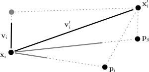

Each individual contains a current position, which evaluates to a fitness value. Each individual also maintains its personal best position <b>p</b><sub><i>i</i></sub> and tracks the global best position <b>p</b><sub><i>g</i></sub> of the swarm, see the figure above. The former encapsulates the cognitive influence, and the latter encapsulates the social influence. A PSO works as an iterative process. After each iteration, the algorithm adjusts the position of each individual based on its knowledge of <b>p</b><sub><i>i</i></sub> and <b>p</b><sub><i>g</i></sub>. This adjustment is analogous to the crossover operation used by GAs. The inertia of an individual, however, allows it to overshoot local minima and explore unknown regions of the problem domain.

Three vectors applied to a particle at position <b>x</b><sub><i>i</i></sub> in one iteration of a PSO:

- A cognitive influence urges the particle toward its previous best <b>p</b><sub><i>i</i></sub>
- A social influence urges the particle toward the swarm's previous best <b>p</b><sub><i>g</i></sub>, 
- Its own velocity <b>v</b><sub><i>i</i></sub> provides inertia, allowing it to overshoot local minima and explore unknown regions of the problem domain.

In PSO, we represent the position of the <i>i</i>th particle as <b>x</b><sub><i>i</i></sub> = (<i>x<sub>i,1</sub>, x<sub>i,2</sub>, &hellip; x<sub>i,D</sub></i>) and its velocity as <b>v</b><sub><i>i</i></sub> = (<i>v<sub>i,1</sub>, v<sub>i,2</sub>, &hellip; v<sub>i,D</sub></i>), where <i>D</i> is the number of dimensions in the parameter space. We represent the particle's previous position with its best fitness as <b>p</b><sub><i>i</i></sub> = (<i>p<sub>i,1</sub>, p<sub>i,2</sub>, &hellip; p<sub>i,D</sub></i>). During each iteration, the algorithm adjusts the velocity <b>v</b> and position <b>x</b> according to the following equations:

<p  style="text-align:center">
    <b>v</b><sup>'</sup><sub style='position: relative; left: -.3em;'><i>i,d</i></sub> &larr; <b>v</b><sub><i>i,d</i></sub> + <i>&Phi;<sub>p</sub> &sdot;r<sub>p</sub> &sdot;</i> (<b>p</b><sub><i>i,d</i></sub> - <b>x</b><sub><i>i,d</i></sub>) + <i>&Phi;<sub>g</sub> &sdot;r<sub>g</sub> &sdot;</i> (<b>p</b><sub><i>g,d</i></sub> - <b>x</b><sub><i>i,d</i></sub>)
    <br/>
    <b>x</b><sup>'</sup><sub style='position: relative; left: -.3em;'><i>i,d</i></sub> &larr; <b>x</b><sub><i>i,d</i></sub> + <b>v</b><sub><i>i,d</i></sub>.

where <i>r<sub>p</sub></i> and <i>r<sub>g</sub></i> are two random values between zero and one, and <i>&Phi;<sub>p</sub></i> and <i>&Phi;<sub>g</sub></i> are two positive constants representing cognitive and social influences. As Shi and Eberhart demonstrated <sup>[10]</sup>, it can be beneficial to include a constant <i>&omega;</i>, which helps balance the global and local search forces. This term directly affects the inertia of the particle.

<p  style="text-align:center">
    <b>v</b><sup>'</sup><sub style='position: relative; left: -.3em;'><i>i,d</i></sub> &larr; <i>&omega;</i> &sdot; <b>v</b><sub><i>i,d</i></sub> + <i>&Phi;<sub>p</sub> &sdot;r<sub>p</sub> &sdot;</i> (<b>p</b><sub><i>i,d</i></sub> - <b>x</b><sub><i>i,d</i></sub>) + <i>&Phi;<sub>g</sub> &sdot;r<sub>g</sub> &sdot;</i> (<b>p</b><sub><i>g,d</i></sub> - <b>x</b><sub><i>i,d</i></sub>)

Here is an example output of the progression of PSO.  The tunable parameters include the ones controlling swarm initialization and the four constants used in the above equation.  As we can see this is a smaller set of hyper-parameters, and it therefore easier in practice to tune.
```
#
# 2018-09-17 11:17:58.573911
#
# algorithm            = _PSOptimizer
# timeout              = None
# max_iterations       = 3
# population_size      = 5
# max_initial_velocity = 0.02
# omega                = 0.9
# phi_particle         = 0.3
# phi_swarm            = 0.1
#
# PARTICLES FOR ITERATION 1
# swarm_fitness           = -52.0662927387
# best_average_fitness    = -84.0623467259
# best_minimum_fitness    = -151.953469262
# best_maximum_fitness    = -52.0662927387
# current_average_fitness = -84.0623467259
# current_minimum_fitness = -151.953469262
# current_maximum_fitness = -52.0662927387
#
# gen idv      fitness       param0       param1       param2       param3 best_fitness  best-param0  best-param1  best-param2  best-param3
    1   0 -40.37828999   0.41091690   0.68928926   0.78620342   0.44130262 -40.37828999   0.41091690   0.68928926   0.78620342   0.44130262
    1   1 -69.92524749   0.62082881   0.60555186   0.06261387   0.74321304 -69.92524749   0.62082881   0.60555186   0.06261387   0.74321304
    1   2 -95.75837161   0.72736678   0.06007673   0.28803797   0.88427085 -95.75837161   0.72736678   0.06007673   0.28803797   0.88427085
    1   3-141.39663771   0.07642868   0.96463784   0.23845186   0.09383131-141.39663771   0.07642868   0.96463784   0.23845186   0.09383131
    1   4-153.14180989   0.29482616   0.90480578   0.98123350   0.05123136-153.14180989   0.29482616   0.90480578   0.98123350   0.05123136
#
# PARTICLES FOR ITERATION 2
# swarm_fitness           = -40.0856570762
# best_average_fitness    = -96.1465355351
# best_minimum_fitness    = -153.141809887
# best_maximum_fitness    = -40.0856570762
# current_average_fitness = -96.6891078889
# current_minimum_fitness = -155.854671656
# current_maximum_fitness = -40.0856570762
#
# gen idv      fitness       param0       param1       param2       param3 best_fitness  best-param0  best-param1  best-param2  best-param3
    2   0 -40.08565708   0.39446909   0.69257608   0.77443090   0.45652994 -40.08565708   0.39446909   0.69257608   0.77443090   0.45652994
    2   1 -68.17505643   0.62144224   0.61723918   0.06973625   0.72593162 -68.17505643   0.62144224   0.61723918   0.06973625   0.72593162
    2   2 -82.95764371   0.70866779   0.10035758   0.33007722   0.85209106 -82.95764371   0.70866779   0.10035758   0.33007722   0.85209106
    2   3-136.37251058   0.06778668   0.95942641   0.25908594   0.08606407-136.37251058   0.06778668   0.95942641   0.25908594   0.08606407
    2   4-155.85467166   0.29824331   0.89860323   0.99166068   0.05384313-153.14180989   0.29482616   0.90480578   0.98123350   0.05123136
#
# PARTICLES FOR ITERATION 3
# swarm_fitness           = -40.0616040836
# best_average_fitness    = -88.4331129724
# best_minimum_fitness    = -140.13366139
# best_maximum_fitness    = -40.0616040836
# current_average_fitness = -88.4331129724
# current_minimum_fitness = -140.13366139
# current_maximum_fitness = -40.0616040836
#
# gen idv      fitness       param0       param1       param2       param3 best_fitness  best-param0  best-param1  best-param2  best-param3
    3   0 -40.06160408   0.37966607   0.69553422   0.76383564   0.47023452 -40.06160408   0.37966607   0.69553422   0.76383564   0.47023452
    3   1 -64.87168134   0.61656695   0.62955921   0.09299702   0.70393642 -64.87168134   0.61656695   0.62955921   0.09299702   0.70393642
    3   2 -69.18782175   0.68496706   0.14956239   0.37763074   0.81447817 -69.18782175   0.68496706   0.14956239   0.37763074   0.81447817
    3   3-127.91079630   0.06723761   0.94883133   0.28906002   0.08727112-127.91079630   0.06723761   0.94883133   0.28906002   0.08727112
    3   4-140.13366139   0.30960401   0.87501209   0.97795285   0.09369333-140.13366139   0.30960401   0.87501209   0.97795285   0.09369333
#
# exit_condition       = ITERATIONS
# iterations           = 3
# execution_time       = 0:00:00.000577
```

### Differential evolution (DEA)

Differential evolution algorithm (DEA) first developed by Storn and Price in 1995 <sup>[11]</sup> is less well-known approach in numerical optimization.  DEA requires less parameter tuning compared with GA and PSO.  After generating and evaluating an initial population, similar to GA and PSO, the solutions are refine as follow.  For each individual solution <i>j</i> choose three other individuals <i>k</i>, <i>l</i>, and <i>m</i> randomly from the population with (<i>i</i> &ne; <i>k</i> &ne; <i>l</i> &ne; <i>m</i>), calculate the difference of the solutions in <i>k</i> and <i>l</i>, scale it by multiplication with a parameter <i>f</i> and create an offspring by adding the result to the solution of <i>m</i>.  The only additional twist in this process is that not the entire solutions of the offspring is created in this way, but that parameters are partly inherited from individual <i>j</i>, such that <i>o<sub>i</sub></i> is <i>m<sub>i</sub></i> + <i>f</i> &sdot; (<i>k<sub>i</sub></i> - <i>l<sub>i</sub></i>) if a random number taken in range [0, 1] is less that <i>p</i>, otherwise <i>o<sub>i</sub></i> is <i>j<sub>i</sub></i>. The proportion is determined by <i>p</i>, which determines how many parameters of the difference vector on average are copied to the offspring <sup>[12]</sup>.

More precisely, the operator iteratively copies consecutive parameters of the difference vector to the offspring until a random number taken in range [0, 1] is greater than or equal to <i>p</i>.  If the offspring <i>o</i> is better than <i>j</i> then <i>j</i> is replaced by <i>o</i>.  This process continues untila maximum length of time expires or a maximum number of iterations is reached.

Here is an example output of the progression of DEA.  The tunable parameters include the ones controlling population initialization and the two constants used in the above equation.  As we can see this is a even smaller set of hyper-parameters, and it is indeed the easiest to tune in practice.

```
#
# 2018-09-17 11:18:30.041420
#
# algorithm             = _DEAOptimizer
# timeout               = None
# max_iterations        = 3
# population_size       = 5
# crossover_probability = 0.5
# differential_weight   = 1.0
#
# POPULATION FOR GENERATION 1
# average_fitness = -103.220667805
# min_fitness     = -216.009531052
# max_fitness     = -43.2574312663
#
# gen idv        fitness      param0      param1      param2      param3
    1   1   -23.05458947  0.67466064  0.58159479  0.62151416  0.02560945
    1   2   -42.92670654  0.65860173  0.18133241  0.43569734  0.62828007
    1   3   -43.88110639  0.33186249  0.32110627  0.62948994  0.06948740
    1   4   -88.45440207  0.68913107  0.70327720  0.31323095  0.98858034
    1   5  -101.57261829  0.70531872  0.94090710  0.00119010  0.16295230
#
# POPULATION FOR GENERATION 2
# average_fitness = -47.0227966257
# min_fitness     = -88.4544020698
# max_fitness     = -23.0545894688
#
# gen idv        fitness      param0      param1      param2      param3
    2   1   -23.05458947  0.67466064  0.58159479  0.62151416  0.02560945
    2   2   -36.79717866  0.70531872  0.94090710  0.49904777  0.38590972
    2   3   -42.92670654  0.65860173  0.18133241  0.43569734  0.62828007
    2   4   -43.88110639  0.33186249  0.32110627  0.62948994  0.06948740
    2   5   -88.45440207  0.68913107  0.70327720  0.31323095  0.98858034
#
# POPULATION FOR GENERATION 3
# average_fitness = -47.0227966257
# min_fitness     = -88.4544020698
# max_fitness     = -23.0545894688
#
# gen idv        fitness      param0      param1      param2      param3
    3   1   -23.05458947  0.67466064  0.58159479  0.62151416  0.02560945
    3   2   -36.79717866  0.70531872  0.94090710  0.49904777  0.38590972
    3   3   -42.92670654  0.65860173  0.18133241  0.43569734  0.62828007
    3   4   -43.88110639  0.33186249  0.32110627  0.62948994  0.06948740
    3   5   -88.45440207  0.68913107  0.70327720  0.31323095  0.98858034
#
# exit_condition       = ITERATIONS
# generations          = 3
```

### Non-population-based derivative-free optimizations

In this section, we will discuss several derivative-free optimizers included in `evolutionary-optimization`.  These methods are provided by `Scipy`.  Unlike GA, PSO, and DEA, the following methods are not evolutionary algorithms and are not population-based.

#### Nelder-Mead optimization (NM)

Nelder-Mead method, or downhill simplex method, was developed by John Nelder and Roger Mead in 1965 <sup>[1]</sup> as a technique to minimize an objective function in a many-dimensional space.  The Nelder-Mead method is an iterative process that continually refines a simplex.  During each iteration, the algorithm evaluates the objective function to determine a score at each point in the simplex and perform one of four actions, expansion, reflection, contraction, and shrinkage.  This process continues until the simplex collapses beyond a predetermined size, a maximum length of time expires, or a maximum number of iterations is reached.

```
#
# 2018-09-11 22:59:32.834599
#
# algorithm            = _NMOptimizer
# timeout              = None
# max_executions       = 1
#
# execution  state    score                    param0              param1              param2              param3
  0          init     -7.321028521739949e+25   -890548.4752138422  563530.4823885201   218631.27647638042  -617595.9876179431
  1          nm-in    -3.581791685726174e+25   400317.510277858    -623767.9998257761  652356.9418816899   -366039.5421164271
  1          nm-iter  -3.2398779332963476e+25  415329.4169132777   -647159.2998192427  587121.247693521    -379766.024945793
  1          nm-iter  -2.7804094031536894e+25  426588.3468898423   -578934.6748382985  603430.171240563    -390060.8870678174
:                                                                                                                             
  1          nm-iter  -74793.05613544572       0.24865659142994612 -15.089151576822292 228.07331711674306  52017.52967177535
  1          nm-out   -74793.05613544572       0.24865659142994612 -15.089151576822292 228.07331711674306  52017.52967177535
```

#### Derivative-free Broyden–Fletcher–Goldfarb–Shanno optimization (BFGS)

For the comparison we also include BFGS in this discussion. BFGS was independently discovered and published in the late 1960s and early 1970s by four researchers Broyden(B), Fletcher(F), Goldfarb(G), and Shanno(S).  BFGS is not a true derivative-free black-box method because it approximates derivatives using the gradient differences across iterations.  BFGS is in the family of quasi-Newton methods, which are used as alternatives to Newton's method when Hessian is unavailable or too expensive to compute at every iteration.

```
#
# 2018-09-11 23:01:32.643957
#
# algorithm            = _BFGSOptimizer
# timeout              = None
# max_executions       = 1
#
# execution  state      score                    param0               param1              param2              param3
  0          init       -1.079221345308267e+25   -168735.44296563067  201044.38188633742  -569888.3913797672  -653417.9818804531
  1          bfgs-in    -5.239012600610719e+25   -707069.0052375677   -665939.0609145632  527258.0547626188   60901.35609409469
  1          bfgs-iter  -3.7350451458823215e+25  -642409.7610086343   -612056.3573904522  500710.966684886    60901.35609409469
  1          bfgs-iter  -3.65111059547324e+25    -696644.9951379239   -577450.2006588789  368266.1974456651   60901.35609409469
:                                                                                                                             
  1          bfgs-iter  -2015848456891039.2      1748.021899531364    -1814.943014227333  6172.949728199636   38075461.61043743
  1          bfgs-out   -2015848456891039.2      1748.021899531364    -1814.943014227333  6172.949728199636   38075461.61043743
```

#### Powell optimization (POW)

Powell's conjugate direction method, is an algorithm proposed by Michael J. D. Powell in 1964 <sup>[20]</sup> for finding a local minimum of a function.  The method minimises the function by a bi-directional search along each search vector, in turn. The bi-directional line search along each search vector can be done by e.g. Golden-section search.  Similar to NM and other optimizers, algorithm iterates an arbitrary number of times until no significant improvement is made.

```
#
# 2018-09-13 09:41:07.532003
#
# algorithm            = _POWOptimizer
# timeout              = None
# max_executions       = 1
#
# execution  state     score                    param0               param1              param2               param3
  0          init      -4.9355586379439785e+25  -272296.1335517209   -835621.0404494442  148619.50096635264   -424121.66907553654
  1          pow-in    -2.916814904786541e+24   -327027.8486122193   -364903.4808649878  -21760.901596044074  -162267.90222150495
  1          pow-iter  -335448225353805.3       1037.9648674547207   1217.3795852361945  -4.310751122462534   18.582554586813785
  1          pow-iter  -245965496.11782235      39.67133685007809    12.323842728109867  5.644491072204051    31.86027946543105 
:                                                                                                                             
  1          pow-iter  -3.7017698981854728      -0.7868049947148263  0.6301855297283054  0.4030980475605346   0.16142580431991077
  1          pow-out   -3.7017698981854728      -0.7868049947148263  0.6301855297283054  0.4030980475605346   0.16142580431991077

```

#### Basin-hopping optimization (BH)

Basin-hopping is a two-phase method that combines a global stepping algorithm with local minimization at each step. It is designed to mimic the natural process of energy minimization of clusters of atoms. It works well for problems with "funnel-like, but rugged" energy landscapes <sup>[13]</sup>.  It can be considered as an ensemble that takes the Monte Carlo approach for the global phase and a local optimizer of choice for the local phase.  Without the latter, this procedure is simulated annealing, a Monte Carlo based black-box optimization algorithm.

```
#
# 2018-09-13 09:44:55.054052
#
# algorithm            = _BHOptimizer
# timeout              = None
# max_executions       = 1
#
# execution  state    score                    param0              param1              param2               param3
  0          init     -3.8396446796938497e+25  260565.22367026843  775341.1382918106   -366122.78001790703  -808873.8522831396
  1          bh-in    -4.250788955154214e+25   164814.46101385588  -807031.5453031991  110583.89452492562   -16699.51706099161
  1          bh-iter  -21007914.553659808      8.22772751363897    67.703620111391     4583.832197259433    21011514.354235046
  1          bh-iter  -12070723.00946148       7.676999663623655   58.94042660630693   3473.9781424521275   12068516.555216294
:                                                                                                                             
  1          bh-iter  -4.677951053265636e-11   0.9999985027640198  0.9999970133658469  0.9999940331967532   0.9999880595279359
  1          bh-out   -6.4008742706503855e-12  0.999999882054017   0.9999996561333312  0.9999991172497616   0.9999981623578718
```


## Evaluation

In applied mathematics, test functions, known as artificial landscapes, are useful to evaluate characteristics of optimization algorithms.  In this section, we will apply a few well-known artificial landscape functions to test the optimization methods included in our `evolutionary-optimization` package.

### Alpine one

```python
def alpine_one(X):
    return -sum([abs(x * numpy.sin(x) + 0.1 * x) for x in X])
```

Here is the surface visualization when the optimization dimension is 2.

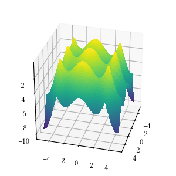 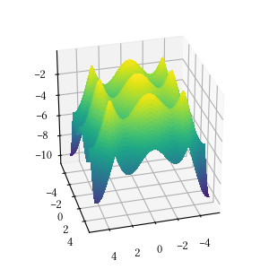 
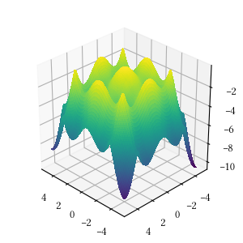 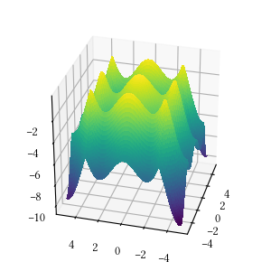

Here is a comparison of optimizer performances when the optimization dimension is 8 and all population-based methods are set to have 25 individuals and 500 iterations with no problem-specific hyper-parameter tuning.

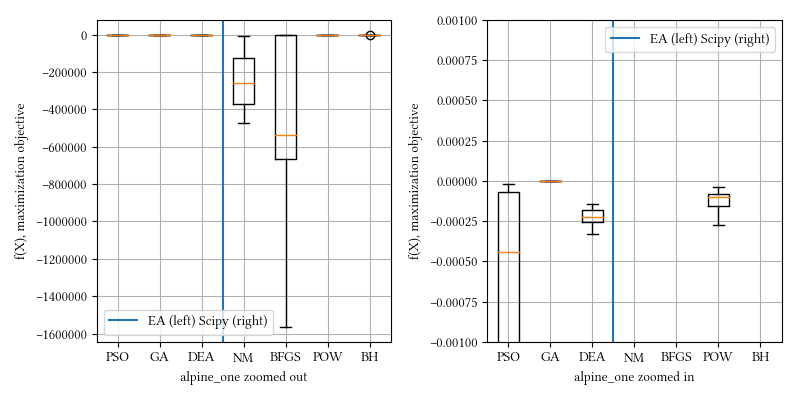

We see BFGS is significantly under-performing than other methods.  This is expected.  BFGS estimates derivatives from iterations.  Since alpine_one is a non-differentiable function, it is not suitable for derivative-aware optimization algorithms, such as BFGS or gradient descent.


### Rastrigin

```python
def rastrigin(X):
    return -(
        10 * len(X) + 
        sum([(x ** 2 - 10 * np.cos(2 * math.pi * x)) for x in X])
    )
```

Here is the surface visualization when the optimization dimension is 2.

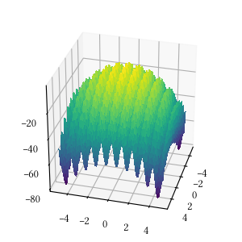 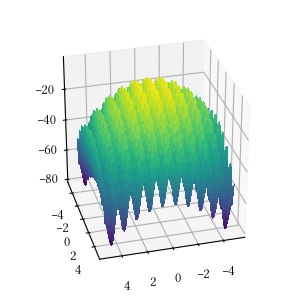
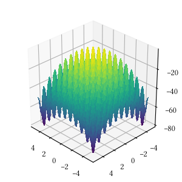 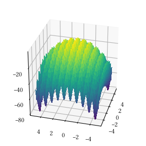

Here is a comparison of optimizer performances when the optimization dimension is 8 and all population-based methods are set to have 25 individuals and 500 iterations with no problem-specific hyper-parameter tuning.


We see here almost all methods, except maybe BFGS, reached a tight and accuracy optima.  DEA delivered the best performance. This landscape function is differentiable but have a rough surface.  


### Rosenbrock

```python
def rosenbrock(X):
    return -sum(
        [100 * (X[i+1] - X[i]**2)**2 + (1 - X[i])**2
        for i in range(len(X) - 1)]
    )
```

Here is the surface visualization when the optimization dimension is 2.

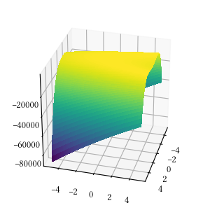 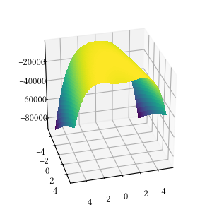
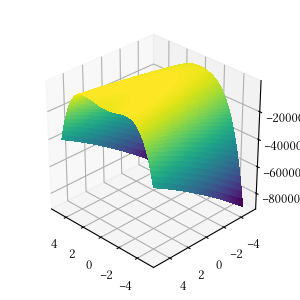 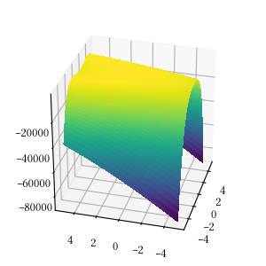

Here is a comparison of optimizer performances when the optimization dimension is 8 and all population-based methods are set to have 25 individuals and 500 iterations with no problem-specific hyper-parameter tuning.

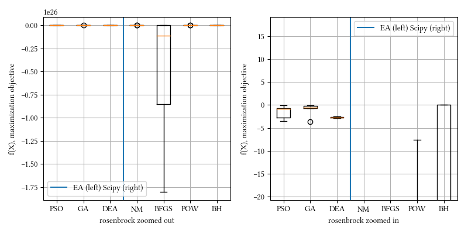

We see here BH and all population-based methods outperforming NM, BFGS, and POW.  The optimization surface seems relatively straightforward, most non-population based optimizer however, fail.  BH has the ingredient of Monte Carlo that creates a somewhat similar behavior as population-base algorithms.


### Sphere

```python
def sphere(X):
    return -sum([x**2 for x in X])
```

Here is the surface visualization when the optimization dimension is 2.

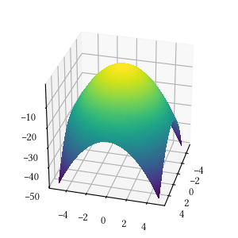 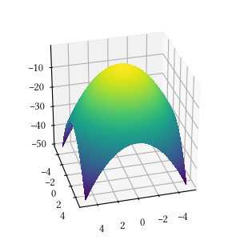
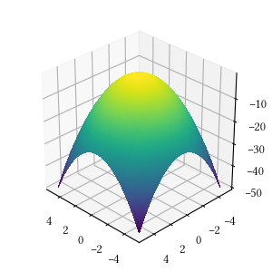 

Here is a comparison of optimizer performances when the optimization dimension is 8 and all population-based methods are set to have 25 individuals and 500 iterations with no problem-specific hyper-parameter tuning.

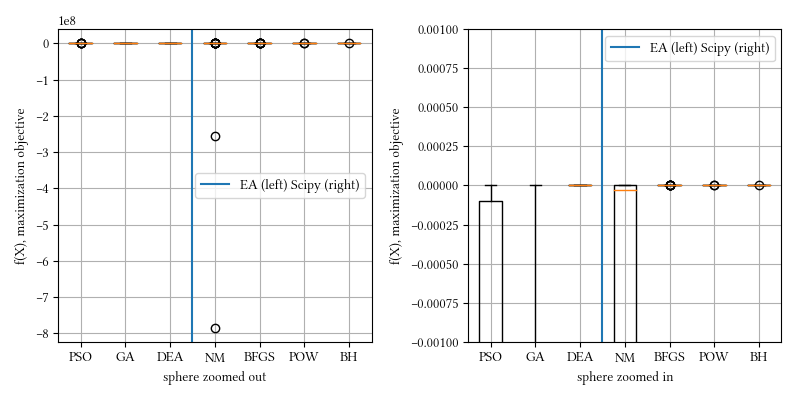

We see here almost all methods reached a tight and accuracy optima, with DEA, BFGS, POW, BH being the best.  The optimization is a simple sphere.  It should be a straightforward task, and it is most suitable for derivative-aware methods, such as BFGS and gradient descent.


## Considerations

We would like to highlight the following considerations when using the `evolutionary-optimization` package or any black-box derivative-free optimization algorithms.

### Parameter space rescaling

Rescaling the parameter space may help the performance significantly for some problems.  Our population-based EA algorithms start with an initial set of individuals and follow an algorithmic procedure to explore the parameter space.  All encoded solutions are linearly interpolated into interval [0, 1].  This interpolation may not be the absolute best for certain problems.  For example, an additional log interpolation can be applied if the parameter space is known to be positive.

### Absolute optima
 
Absolute optima is *not* always the goal even when the problem formulation is optimization in nature.  The most suitable optimization subroutine is not always the one that produces the absolute optima.  For example, in a DNN, we optimize a loss function and directly infer edge weights, but we don't care about edge weights themselves.  It's likely multiple optima produce the same classification outcome, which is what we care about.  In addition, over fitting is a common issue, so it's not advisable to pursue absolute optima.  On the other hand, if we optimize a parametrized statistical model where the model parameters are the variable of interest directly, we would want the absolute optima.

### Comparison with derivative-aware optimizers

Black-box optimizers are not meant to be compared with derivative-aware optimizers.  If we know the analytical form of an objective function, and the derivatives (first, second order) are not crazy to obtain, it's always advisable to take advantage of the derivative information.  This, however, is not feasible in many cases, probably the majority engineering scenarios.  In addition, black-box optimizers enables a drop-and-go solution that impose no assumption in the objective function as long as we can evaluate it's value given a parameter set, so it's lightweight and could be preferred even at the cost of time or even convergence.

### Dimensionality

Black-box optimization algorithms are lightweight but, by nature, they are not capable of dealing with huge parameter dimensions.  In cases where function formulation can easily be scaled to have hundreds, thousands, or even more parameters, black-box optimizations would not work.  For instance, topic modeling, structure analysis, and DNN, are in this category.  Rigorous optimization approaches that make use of the derivatives should be considered, such as back propagation combined with gradient descent for DNN and quadratic programming in structure analysis.  If derivatives are unattainable, then sampling techniques such as MCMC could be a possibility.

### Constraints

All test functions used in this discussion are unconstrained.  The optimization method in `evolutionary-optimization` are created to work with unconstrained problems.  This does not mean that these optimizers are incompatible with all constraints.  For example, a simple approach to incorporate range constraints is by assigning dis-favorable value, e.g. negative infinity, in the objective function when parameters are out of bounds.  This, however, is a relatively dangerous maneuver and often require extra care during parameter initialization, otherwise optimizers may stuck in a "death" zone and never recover.

## Summary

We present `evolutionary-optimization`, an open-source toolset for derivative-free black-box optimization algorithms. It focuses on evolutionary algorithms, which is a subset of evolutionary computation utilized in the field of artificial intelligence.  We can also refer them as generic population-based meta-heuristic optimization algorithms.

In the experiment section, we see that non-population based algorithms can be preferable, especially in straightforward optimization problems, such as the high-dimension Sphere function.  When the objective surface is rough, such as the Rastrigin function, we see that DEA seems preferable.  We observe that a seemingly straightforward objective surface from the Rosenbrock function poses challenge, and GA outperforms other EA methods. We also had cases [18] where PSO outperforms the rest.

<!--
Here is another set of experiments with an even higher parameter dimension, 12 instead of 8.  We can see some changes in the comparison and best-achieving optimizers.

12-param alpine_one:

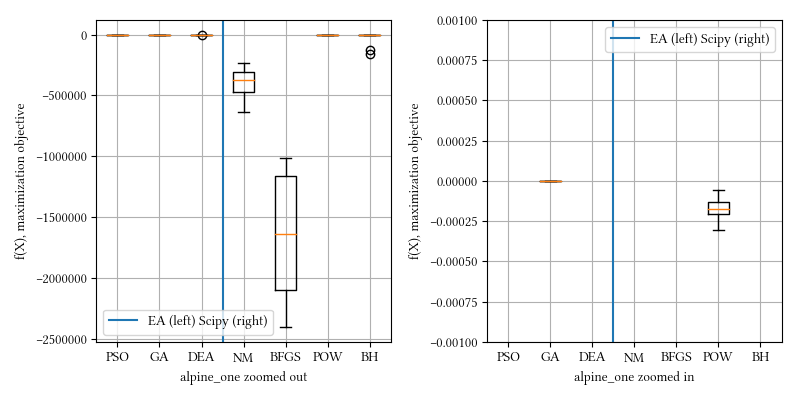

12-param rastrigin:

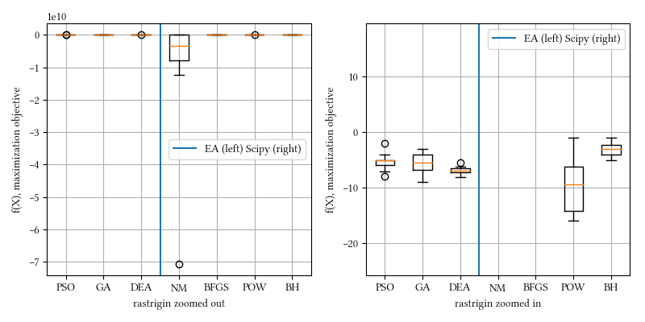

12-param rosenbrock:


12-param sphere:

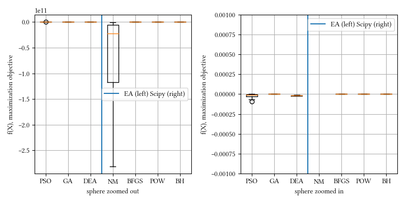
-->

We would like to point out that Scipy provides a version of DEA as well.  Here we present another set of experiment that include Scipy's version (SDEA).  In this experiment, we explore a much higher parameter space dimension, 20 instead of 8.  

20-param alpine_one:

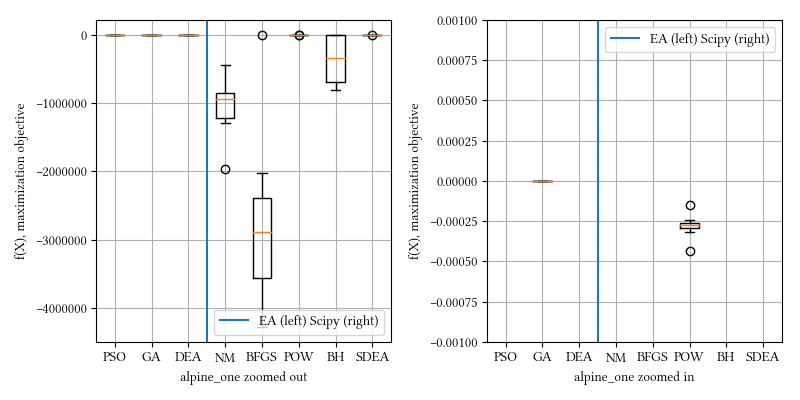

20-param rastrigin:

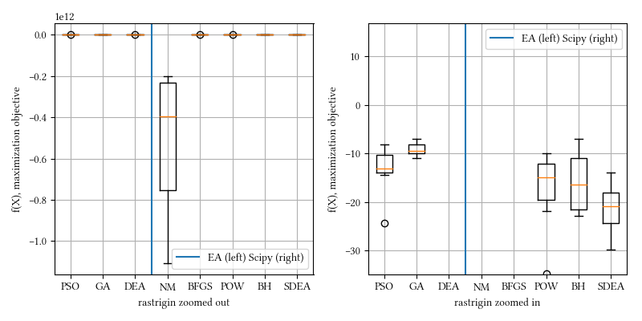

20-param rosenbrock:

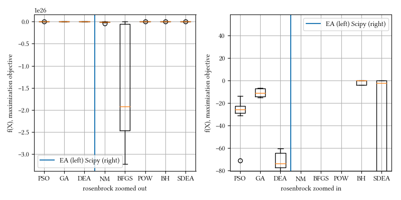

20-param sphere:

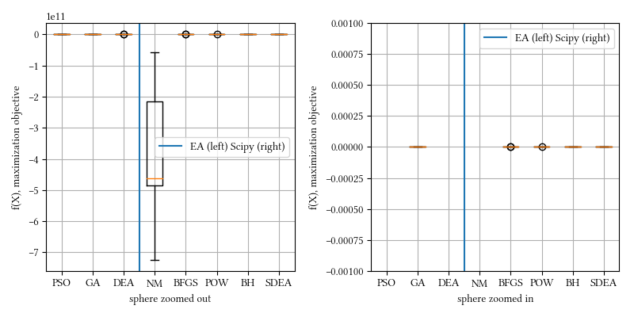

We can see, in the above experiment, the best-achieving optimizers are not all the same as in with 8-param experiment.  We do not intend to use these experiments to draw sweeping conclusions about which optimizer is better.  These are already winners in their own category.  For instance, there are many population-based algorithms not included in this discussion, and more are actively been invented.  Some are shown better in certain scenarios, but people have learned to be sceptical whenever a claim is made about optimization superiority.

In summary, optimization scenarios can be complex and counter intuitive.  In reality, we often have little idea of the objective surface, e.g. DNN parameter search, which is thought to be suitable for PSO [19].  It is important to select a suitable method based on the specific problem.  Sometimes it even requires hyper-parameter tuning, which can easily be another layer of optimization of its own.  This behavior is similar to other machine learning techniques, e.g. classifier selection.

## Related works

1. J. A. Nelder, R. Mead, A simplex method for function minimization, The Computer Journal 7 (4) (1965) 308-313. doi:10.1093/comjnl/7.4.308.

2. J. H. Holland, Genetic algorithms, Scientific American 267 (1) (1992) 6672.

3. D. E. Goldberg, Genetic Algorithms in Search, Optimization and Machine Learning, 1st Edition, Addison-Wesley Longman Publishing Co., Inc., Boston, MA, USA, 1989.

4. J. E. Baker, Reducing bias and inefficiency in the selection algorithm, in: Proceedings of the Second International Conference on Genetic Algorithms on Genetic algorithms and their application, L. Erlbaum Associates Inc., Hillsdale, NJ, USA, 1987, pp. 14-21.

5. B. L. Miller, B. L. Miller, D. E. Goldberg, D. E. Goldberg, Genetic algorithms, tournament selection, and the effects of noise, Complex Systems 9 (1995) 193-212.

6. G. Syswerda, Uniform crossover in genetic algorithms, in: J. D. Schaffer (Ed.), Proceedings of the Third International Conference on Genetic Algorithms, Morgan Kaufmann, 1989, pp. 2-9.

7. Z. Michalewicz, Genetic algorithms + data structures = evolution programs (1996).

8. K. Deb, 2001, multiobjetive optimization using evolutionary algorithms (2001).

9. R. Eberhart, J. Kennedy, A new optimizer using particle swarm theory, in: Proceedings of the Sixth International Symposium on Micro Machine and Human Science, 1995., 1995, pp. 39-43. doi:10.1109/MHS.1995. 494215.

10. Y. Shi, R. Eberhart, A modified particle swarm optimizer, in: Evolutionary Computation Proceedings, 1998. IEEE World Congress on Computational Intelligence., The 1998 IEEE International Conference on, 1998, pp. 69-73. doi:10.1109/ICEC.1998.699146.

11. Storn, R. and Price, K., Differential Evolution - a Simple and Efficient Adaptive Scheme for Global Optimization over Continuous Spaces, Technical Report TR-95-012, ICSI, March 1995, ftp.icsi.berkeley.edu. Anyone who is interested in trying Differential Evolution (DE)

12. S. Paterlini and T. Krink, Differential evolution and particle swarm optimisation in partitional clustering, Comput. Stat. Data Anal., vol. 50, no. 5, pp. 1220-1247, Mar. 2006.

13. Olson, B., Hashmi, I., Molloy, K. and Shehu, A., 2012. Basin hopping as a general and versatile optimization framework for the characterization of biological macromolecules. Advances in Artificial Intelligence, 2012, p.3.

14. Vikhar, P. A. "Evolutionary algorithms: A critical review and its future prospects

15. https://en.wikipedia.org/wiki/Derivative-free_optimization

16. https://link.springer.com/article/10.1007/s11081-016-9307-4

17. https://en.wikipedia.org/wiki/Evolutionary_algorithm

18. Cheng, J.Y. and Mailund, T., 2015. Ancestral population genomics using coalescence hidden Markov models and heuristic optimisation algorithms. Computational biology and chemistry, 57, pp.80-92.

19. Qolomany, B., Maabreh, M., Al-Fuqaha, A., Gupta, A. and Benhaddou, D., 2017, June. Parameters optimization of deep learning models using Particle swarm optimization. In Wireless Communications and Mobile Computing Conference (IWCMC), 2017 13th International (pp. 1285-1290). IEEE.

20. Powell, M.J., 1964. An efficient method for finding the minimum of a function of several variables without calculating derivatives. The computer journal, 7(2), pp.155-162.
